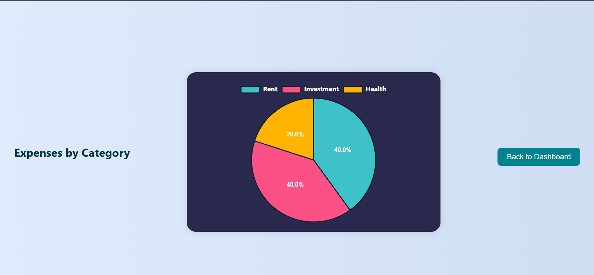
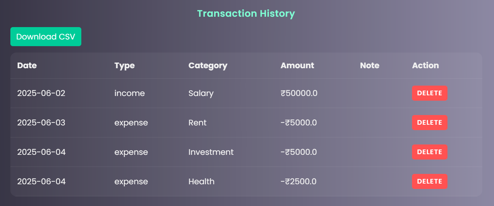

# budget-tracker
A simple and beginner-friendly **web-based Personal Budget Tracker** built using **Python (Flask)**.  
This application helps users track their **income and expenses**, view balance, and manage their budget easily.

## 🚀 Features

- ➕ Add Income and Expenses
- 💰 View Current Balance
- 📊 Track Total Income and Total Expenses
- 🗑️ Delete Transactions
- 📉 Budget Goal Progress Bar
- 📊 Chart Visualization (Income vs Expenses)
- 🧾 Data stored using CSV file
- 🌐 Simple Web Interface

## 🛠️ Technologies Used

- Python
- Flask
- HTML
- CSS
- Chart.js
- CSV (for storage)

## 📁 Project Structure

budget_tracker/
│
├── app.py
├── data.csv
├── templates/
│ └── index.html
├── static/
│ └── style.css
├── images/
│ ├── home.png
│ ├── add.png
│ └── chart.png
└── README.md

##  Screenshots

###  Home Page

###  Add Transaction

###  pie Chart View

### month comparison

### Main page of upload

### Goal

### Login

### Transaction History

## ⚙️ How to Run the Project

### 1. Clone the repository

git clone https://github.com/yourusername/budget-tracker.git

### 2. Go to project folder

cd budget-tracker

### 3. Install Flask

pip install flask

### 4. Run the application

python app.py

### 5. Open in browser

http://127.0.0.1:5000

---

## 📌 Future Improvements

- 🔐 User Login System
- 📅 Monthly Filtering
- 📥 Export Data as CSV
- 🌙 Dark Mode
- 📱 Mobile Responsive Design

---

## 👨‍💻 Author

MOKSHAGNA RAJU
